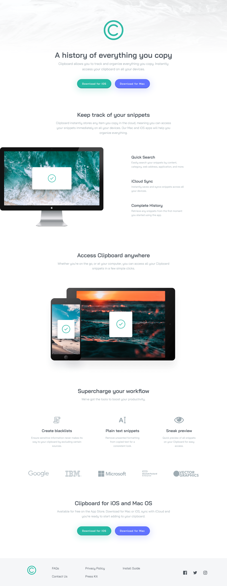

# Frontend Mentor - Clipboard landing page solution

This is a solution to the [Clipboard landing page challenge on Frontend Mentor](https://www.frontendmentor.io/challenges/clipboard-landing-page-5cc9bccd6c4c91111378ecb9). Frontend Mentor challenges help you improve your coding skills by building realistic projects. 

## Table of contents

- [Overview](#overview)
  - [The challenge](#the-challenge)
  - [Screenshot](#screenshot)
  - [Links](#links)
- [My process](#my-process)
  - [Built with](#built-with)
  - [What I learned](#what-i-learned)
  - [Continued development](#continued-development)
  - [Useful resources](#useful-resources)
- [Author](#author)

**Note: Delete this note and update the table of contents based on what sections you keep.**

## Overview

### The challenge

Users should be able to:

- View the optimal layout for the site depending on their device's screen size
- See hover states for all interactive elements on the page

### Screenshot




### Links

- Solution URL: [Github](https://github.com/MikeBeloborodov/clipboard_landing_page)
- Live Site URL: [Netlify](https://chimerical-melomakarona-7a7a67.netlify.app/)

## My process

### Built with

- Semantic HTML5 markup
- CSS custom properties
- Flexbox
- CSS Grid
- Mobile-first workflow

### What I learned

It was a pretty straightforward project, but I had an opportunity to learn a few things!

First of all I tried to add width and height of every picture in my project. When you do it images break and you have to use some CSS to help them: 

```CSS
.img-computer {
    max-width: 100%;
    height: auto;
    width: auto;
}
```
When you set height and width to auto and max-width to 100% image will take it's normal ratio and become responsive.

Another learning opportunity came from a need to make an SVG image change color on hover. At first I thought to write down 2 img containers in HTML code and then switch their display on hover, but it's either too hard or not even possible, so I googled more and found a better way - you can just use filters to change color:

```CSS
.footer__link-icon:hover {
    filter: invert(51%) sepia(84%) saturate(387%) hue-rotate(122deg) brightness(102%) contrast(86%);
}
```

### Continued development

Continue develop better feel for BEM naming convention, use less utility classes.

### Useful resources

- [HEX to SVG filter converter](https://isotropic.co/tool/hex-color-to-css-filter/) - This helped me to convert HEX color into a SVG image filter.

## Author

- Github - [Mike Beloborodov](https://github.com/MikeBeloborodov)
- Frontend Mentor - [@MikeBeloborodov](https://www.frontendmentor.io/profile/MikeBeloborodov)